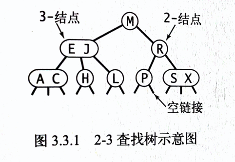
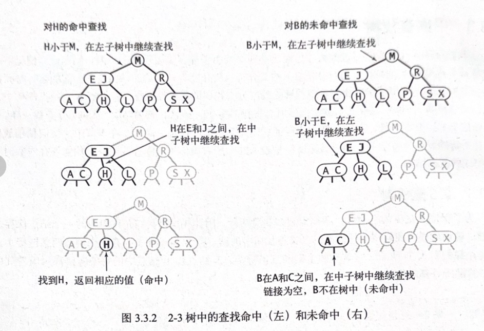
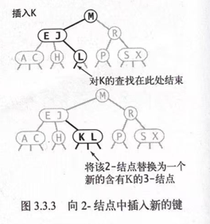
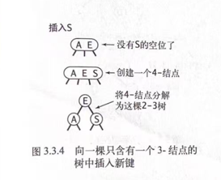
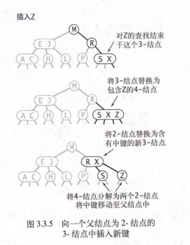
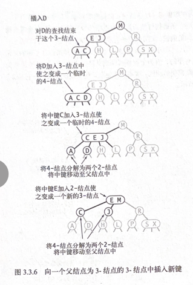
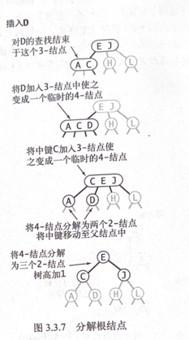
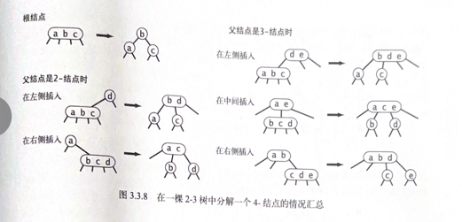
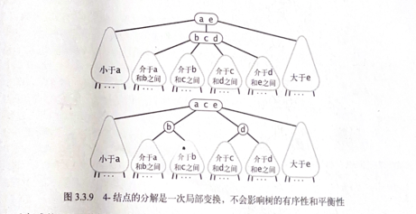

## 2-3查找树
为了保证查找树的平衡性，我们需要一些灵活性，因此在这里我们允许树中的一个结点保存多个键。
### 2-结点
我们把一棵标准的二叉查找树中的结点称为 2-结点：含有一个键和两条链接。

### 3-结点
它含有两个键和三条链接。

### 完美平衡
一棵完美平衡的2-3查找树中的所有空链接到根结点的距离都应该是相同的。

### 查找

### 向2-结点中插入新键
二叉查找树把新结点挂在树的底部，这样就导致树无法保持完美平衡性。
我们使用2-3树的主要原因就在于它能够在插入后继续保持平衡。如果未命中的查找结束于一个2-结点，事情就好办了：我们只要把这个2-结点替换为一个3-结点，将要插入的键保存在其中即可。

如果未命中的查找结束于一个3-结点，事情就要麻烦一些。

### 向一棵只含有一个3-结点的树中插入新键

### 向一个父结点为2-结点的3-结点中插入新键

### 向一个父结点为3-结点的3-结点中插入新建

### 分解根结点

### 局部变换

