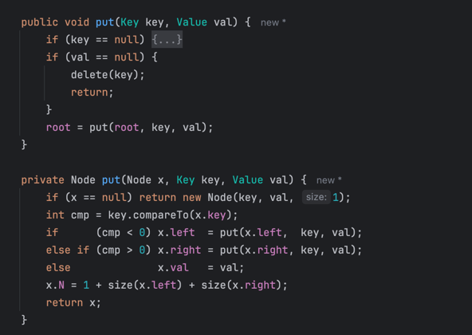
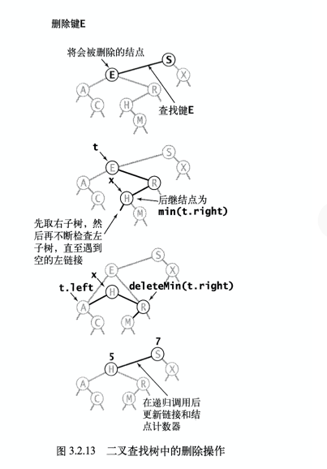

## 二叉查找树(Binary Search Tree)，也称有序二叉树(ordered binary tree) 或 排序二叉树(sorted binary tree)

### 数据结构

#### 关于结点计数器 N
size(x) = size(x.left) + size(x.right) + 1

### get()方法

### put()方法

### 输入序列 S E A R C H E X A M P L E 构建二叉查找树的过程

### 如果输入序列是 A C E H R S X 会如何？

### 删除操作
仔细想想，这是个问题。

## 有序性相关的方法
### 最大键、最小键

### 向上取整和向下取整

#### 另一个版本的floor

### select() 和 排名rank()

rank()是select()的逆方法

### 删除操作
#### 删除最小键和删除最大键

#### 删除操作

### 范围查找 

### 性能总结

