## 符号表（Symbol Tables）的两种基本实现

### 基于无序链表的实现
SequentialSearchST
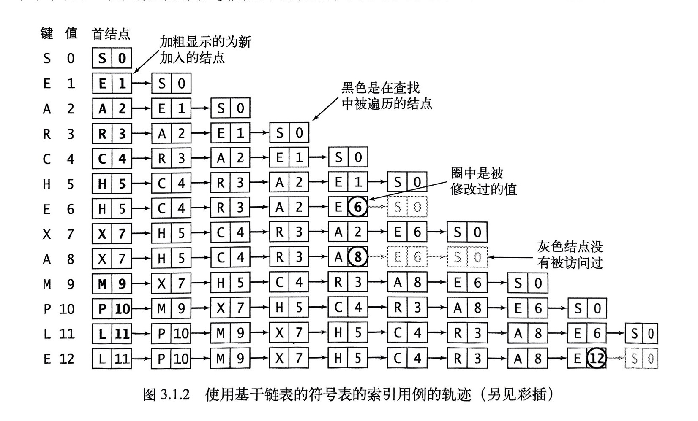

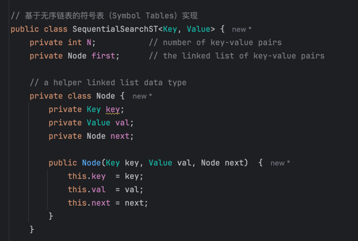
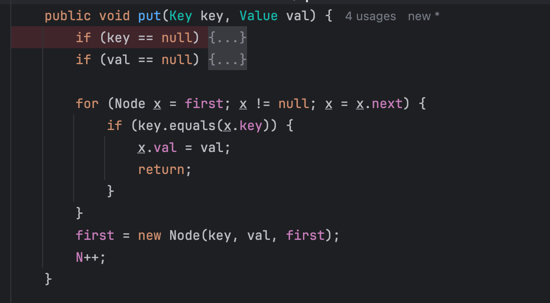
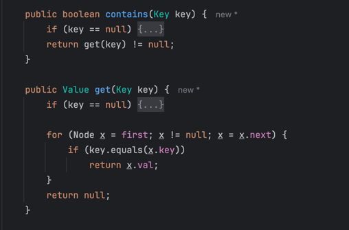

### 基于有序数组的实现（二分查找）

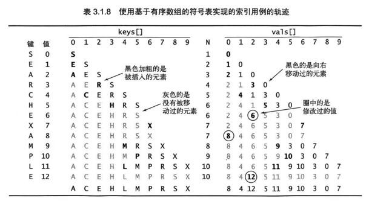
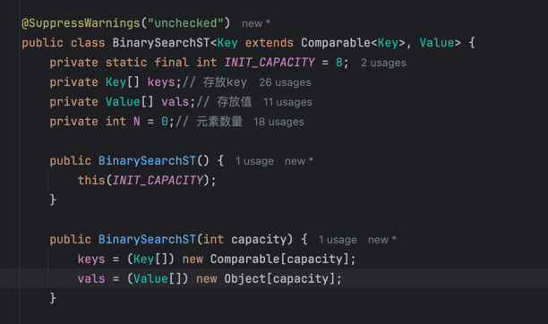

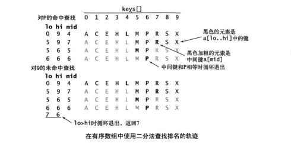
#### rank方法
返回表中小于给定键(key)的键的数量。

该方法首先将key和中间键比较，如果相等则返回其索引；如果小于中间键则在左半部分查找；大于则在右半部分查找。
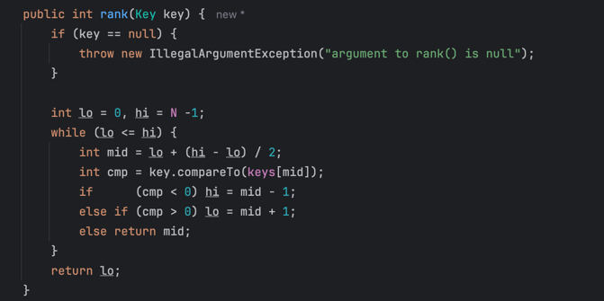
#### get方法
对于get()方法，只要给定的键存在于表中，rank()方法就能够精确地告诉我们在哪里能够找到它（如果找不到，那它肯定就不在表中）。
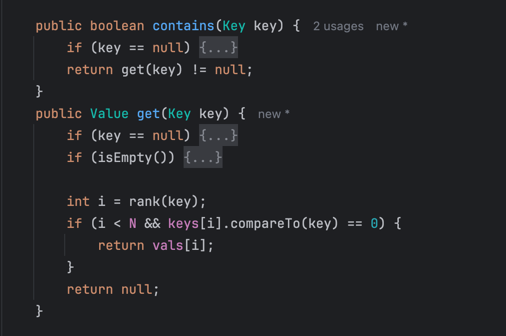
#### put方法
对于put()方法，只要给定的键存在于表中，rank()方法就能够精确地告诉我们到哪里去更新它的值。以及当键不在表中时将键存储到表的何处，这时我们将所有更大的键向后移动一格来腾出位置并将给定的键值对分别插入到各自数组中的合适位置。
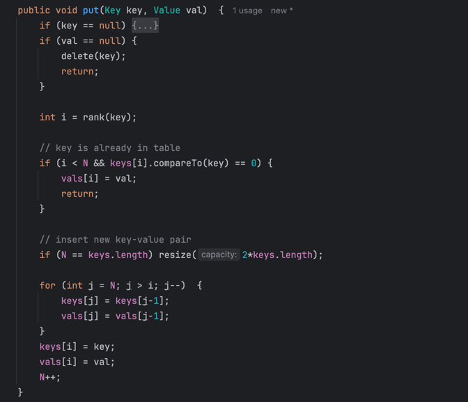
#### 各方法的成本
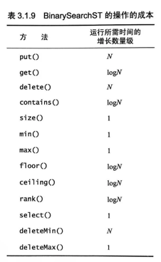

### 简单符号表实现的成本总结
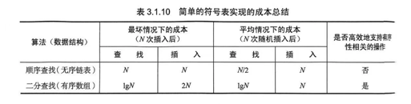

#### 核心问题
在于我们需要能够同时保证查找和插入操作都是对数级别的算法和数据结构。
#### 如何实现这个目标？
要支持高效的插入操作，我们似乎需要一种链式结构。但单链接的链表是无法使用二分查找的，因为二分查找的高效来自于能够快速通过索引取得任何子数组的中间元素（但得到一条链表的中间元素的唯一方法只能是沿链表遍历）。为了将二分查找的效率和链表的灵活性结合起来，我们需要更加复杂的数据结构。
能够同时拥有两者的就是 二叉查找树（BinarySearchTree)，BST

