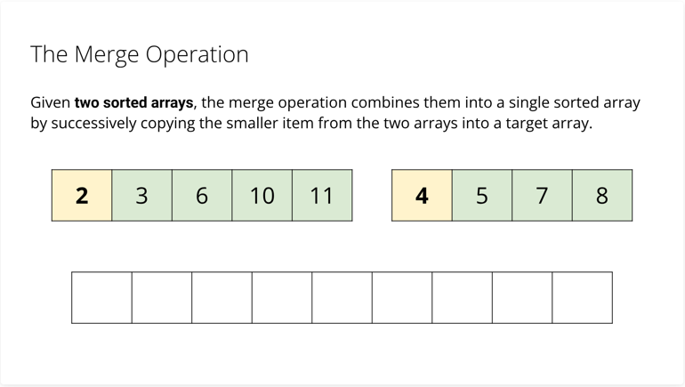
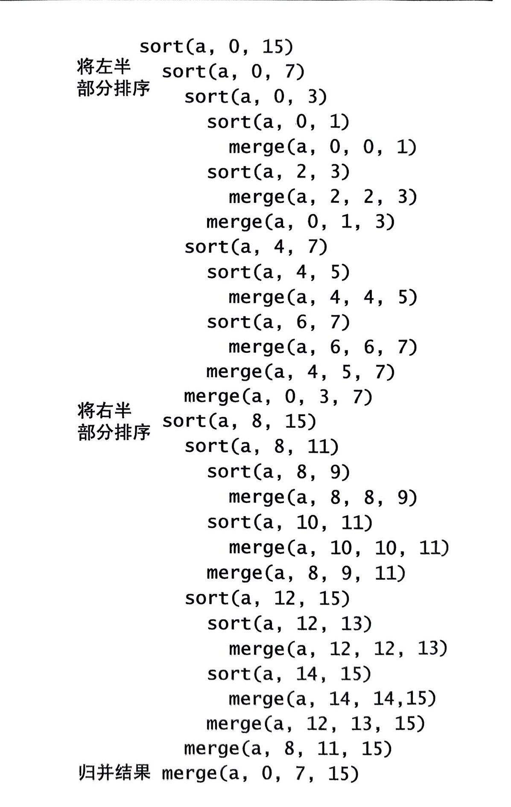
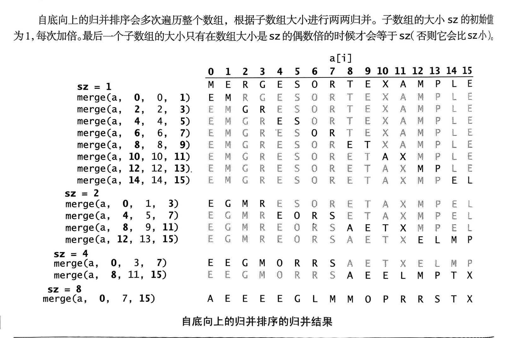

## 合并两个有序的数组
#### private static void merge(Comparable[] a, int lo, int mid, int hi)

## 如何理解合并排序？
1. 数量为1的数组是有序的
2. 对两个数量为1的数组执行merge，结果是数量为2的有序数组
3. 对两个数量为2的有序数组执行merge，结果是数量为4的有序数组
4. ......
5. 对两个数量为n的有序数组执行merge，结果是数量为2*n的有序数组
#### merge()才是目的

### 递归合并（自顶向下）
#### 递归是“分治思想”的典型应用：
#### sort()方法的作用，在于安排多次merge()方法调用的正确顺序。而已。

#### 问：不使用递归，是否也可以安排多次merger()方法调用的正确顺序？
#### 答：可以！

### 自底向上合并

