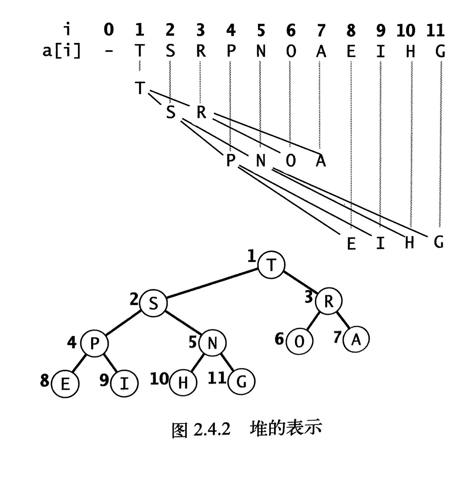
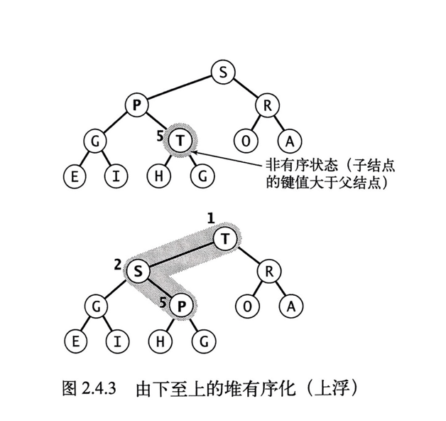
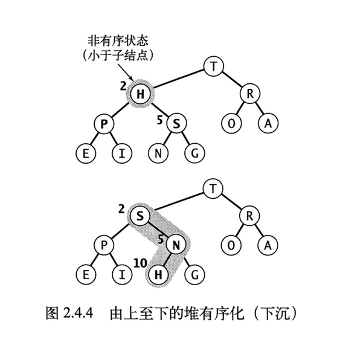
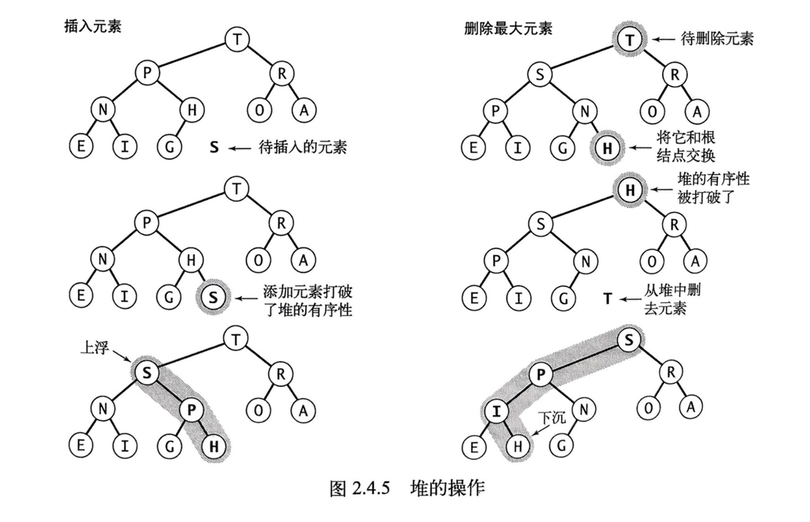
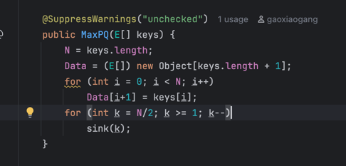

## 优先队列(Priority Queues)
之前学过的选择、插入、合并、快速等排序算法，都是严格的把数据处理成全部有序。
许多应用程序都需要处理有序的元素，但不一定要求它们全部有序。或者不一定要一次就将它们排序。
我们会收集一些元素，处理当前值最大的元素，然后再收集更多的元素，再处理当前值最大的元素。
如：事件或任务按优先级调度。

#### 优先队列的数据结构应该支持两种操作：
1. 删除最大元素
2. 插入元素

### 什么是堆？
当一棵二叉树的每个结点都大于等于它的两个子结点时，被称为堆有序。
根节点是二叉树中的最大结点。

### 完全二叉树
用数组即可以高效的表示。
1. 位置为 k 的节点的父节点的位置为 ⌊k/2⌋
2. 它的两个子节点位置为 2k 和 2k+1
3. 位置0留空，不使用

#### 上浮(swim)

#### 下沉(sink)

#### 堆的操作

## 从无序的数组构造堆

### 问题：
1. 构造过程中，最多会有多少次交换？多少次比较？
2. 是否可以通过 swim() 来构造堆？

