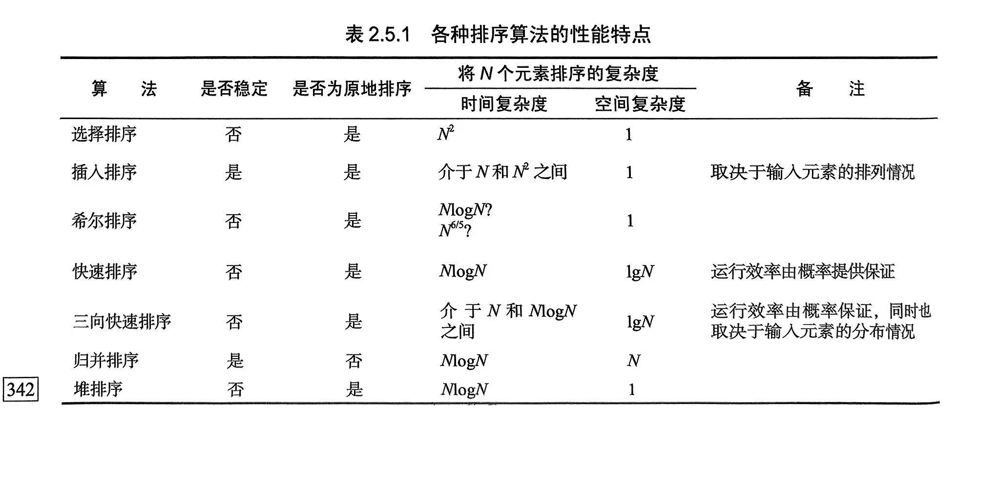
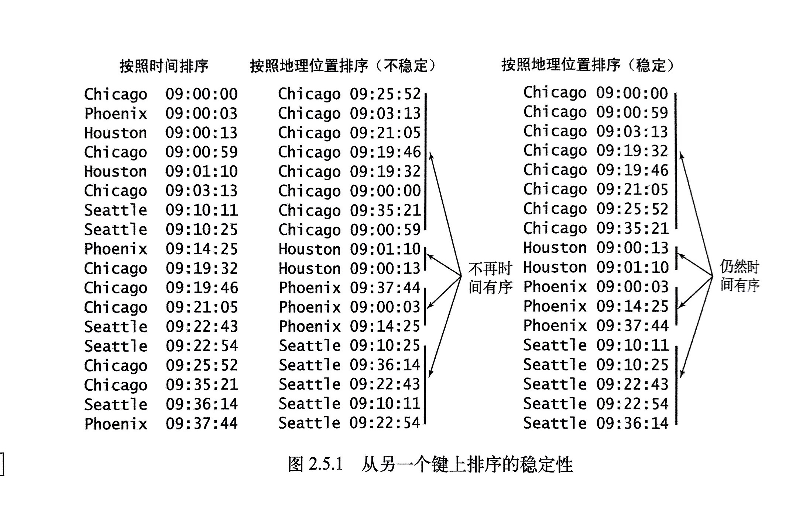

### 快速排序是最快的通用排序算法。
1. 它的内循环中的指令很少，能利用缓存（它总是顺序地访问数据）
2. 所以它的运行时间的增长数量级为 ~cNlgN。这里的c比其他线性对数级别的排序算法的相应常数都要小。
3. 在使用三向切分之后，快速排序对于实际应用中可能出现的某些分布的输入变成线性级别的，而其他的排序算法则仍然需要线性对数时间。

因此，快速排序是最佳选择。
### java的情况
1. 对原始数据类型使用（三向切分的）快速排序
2. 对引用类型使用 合并排序。
3. 这种选择暗示着 用速度和空间(相对于原始数据类型)来换取稳定性。
因为快速排序不是稳定的排序。

### 稳定性
#### 定义
如果一个排序算法能够保留数组中重复元素的相对位置则可以被称为是稳定的。这个性质在许多情况下很重要。

